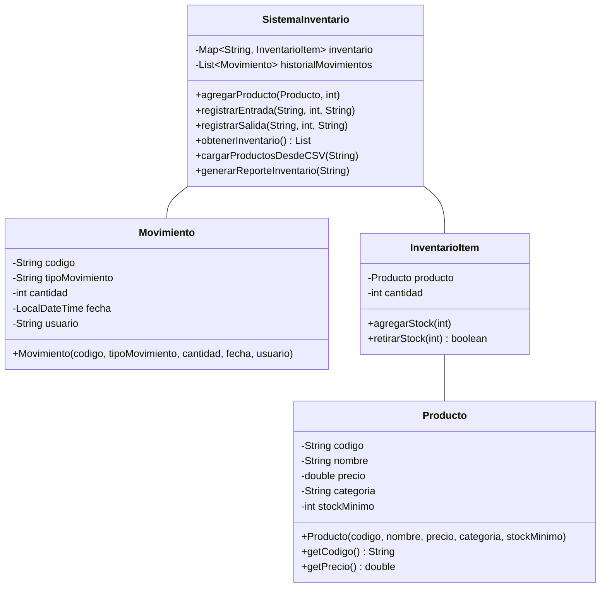

# Sistema de Gestión de Inventario (Pyrants T-Store

Sistema de inventario desarrollado en Java para gestionar productos, registrar movimientos de entrada/salida y generar reportes. Utiliza programación orientada a objetos y persistencia de datos mediante archivos.

## Características Principales

- **Gestión de Productos**: Crear y administrar productos con múltiples atributos (código, nombre, precio, categoría, stock mínimo)
- **Registro de Movimientos**: Control de entradas y salidas con fecha, hora y usuario
- **Inventario en Tiempo Real**: Consulta del estado actual del inventario
- **Carga Masiva**: Importación de productos desde archivos CSV
- **Persistencia de Datos**: Almacenamiento automático en archivos locales
- **Generación de Reportes**: Exportación de inventario y movimientos en formato TXT

## Estructura del Proyecto

```
src/
├── models/
│   ├── Producto.java          # Clase para representar productos
│   ├── Movimiento.java         # Clase para registrar movimientos
│   └── InventarioItem.java     # Clase que vincula producto con cantidad
├── services/
│   └── SistemaInventario.java  # Lógica principal del sistema
└── ui/
    └── MenuPrincipal.java      # Interfaz de consola
```

## Diagrama de Clases



## Requisitos

- Java 8 o superior
- No requiere dependencias externas

## Instalación y Ejecución

### Compilar el proyecto
```bash
javac -d bin src/**/*.java
```

### Ejecutar el programa
```bash
java -cp bin ui.MenuPrincipal
```

## Uso del Sistema

### Menú Principal

Al iniciar el programa, se presenta el siguiente menú:

```
=== SISTEMA DE GESTIÓN DE INVENTARIO ===
1. Agregar nuevo producto
2. Registrar entrada
3. Registrar salida
4. Ver inventario completo
5. Buscar producto
6. Cargar productos desde CSV
7. Generar reportes
8. Salir
```

### Operaciones Principales

#### 1. Agregar Producto
Permite crear un nuevo producto ingresando:
- Código único
- Nombre
- Precio
- Categoría
- Stock mínimo
- Cantidad inicial

#### 2. Registrar Entrada
Registra el ingreso de unidades a un producto existente:
- Código del producto
- Cantidad a ingresar
- Usuario que realiza la operación

#### 3. Registrar Salida
Registra la salida de unidades de un producto:
- Código del producto
- Cantidad a retirar
- Usuario que realiza la operación
- Validación de stock disponible

#### 4. Ver Inventario
Muestra el listado completo de productos con:
- Información del producto
- Cantidad disponible
- Alertas de stock bajo

#### 5. Buscar Producto
Búsqueda específica por código de producto

#### 6. Carga Masiva desde CSV
Importa múltiples productos desde un archivo CSV con formato:
```
codigo,nombre,precio,categoria,stock_minimo,cantidad
```

Ejemplo:
```csv
P001,Laptop Dell,1200.50,Electrónica,5,10
P002,Mouse Logitech,25.99,Accesorios,20,50
```

#### 7. Generar Reportes
- **Reporte de Inventario**: Estado actual de todos los productos
- **Reporte de Movimientos**: Historial filtrado por rango de fechas

## Persistencia de Datos

El sistema guarda automáticamente la información en:
- `productos.dat`: Productos e inventario actual
- `movimientos.dat`: Historial completo de movimientos

Los datos se cargan automáticamente al iniciar el programa.

## Conceptos de POO Aplicados

- **Encapsulamiento**: Atributos privados con getters/setters
- **Composición**: InventarioItem compuesto por Producto
- **Colecciones**: Uso de Map y List para gestionar datos
- **Manejo de fechas**: LocalDateTime para timestamps
- **Manejo de archivos**: I/O para persistencia y reportes
- **Manejo de excepciones**: Try-catch para operaciones críticas

## Validaciones Implementadas

- ✓ Código de producto único
- ✓ Precios positivos
- ✓ Cantidades válidas (≥ 0)
- ✓ Stock suficiente para salidas
- ✓ Formato correcto en CSV
- ✓ Existencia de producto antes de operaciones

## Formato de Reportes

Los reportes se generan en formato texto plano (.txt) con estructura tabular legible.

### Ejemplo Reporte de Inventario
```
========================================
   REPORTE DE INVENTARIO
========================================
Fecha: 2024-12-11 14:30:00

Código    Nombre         Precio    Stock
---------------------------------------
P001      Laptop Dell    1200.50   10
P002      Mouse          25.99     50
...
```

## Autores

[Tu Nombre] - [Tu Correo/GitHub]  
[Compañero 1] - [Correo/GitHub]

## Notas de Desarrollo

- Desarrollado como proyecto académico
- Implementa conceptos de Programación Orientada a Objetos
- Sistema de consola interactivo
- Manejo completo de archivos (lectura/escritura)

---

**Curso**: [Nombre del Curso]  
**Fecha**: Diciembre 2024
