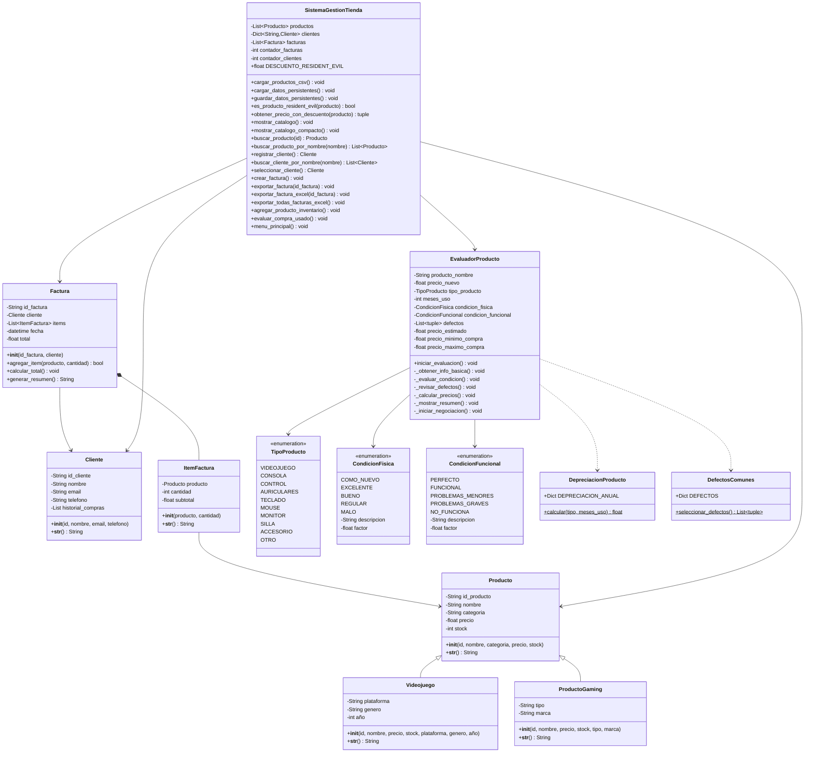

# Sistema de Gestión de Tienda de Videojuegos - Pyrants T-Store

Sistema completo de gestión para tienda de videojuegos desarrollado en Python. Maneja inventario, clientes, ventas, facturación y evaluación de productos usados, con persistencia de datos y exportación a múltiples formatos.

## Características Principales

- **Gestión de Inventario**: Catálogo completo de videojuegos y productos gaming con precios dinámicos
- **Sistema de Descuentos**: Descuento automático del 15% en productos de Resident Evil
- **Gestión de Clientes**: Registro y búsqueda avanzada de clientes con historial de compras
- **Facturación Completa**: Creación de facturas con múltiples formatos de exportación (TXT, Excel)
- **Evaluación de Usados**: Sistema avanzado para valorar productos usados considerando depreciación, condición y defectos
- **Persistencia de Datos**: Almacenamiento automático en JSON para clientes y facturas
- **Carga desde CSV**: Importación masiva de productos desde archivos
- **Exportación a Excel**: Reportes individuales y consolidados con formato profesional

## Estructura del Proyecto

```
Inventario/
├── __init__.py
├── productos.py           # Clases de productos (Producto, Videojuego, ProductoGaming)
├── cliente.py            # Gestión de clientes
├── factura.py            # Sistema de facturación (Factura, ItemFactura)
├── venta.py              # Evaluación de productos usados
└── sistemagestion.py     # Lógica principal del sistema

utils/
├── videojuegos.csv       # Catálogo de videojuegos (120+ productos)
├── productos_gaming.csv  # Productos gaming (45+ items)
├── clientes.json         # Base de datos de clientes
└── facturas.json         # Historial de facturas

facturas/                 # Directorio de exportación
main.py                   # Punto de entrada del sistema
```

## Diagrama de Clases Completo



## Requisitos

- Python 3.8 o superior
- openpyxl (opcional, para exportación a Excel): `pip install openpyxl`

## Instalación y Ejecución

### Ejecutar el sistema
```bash
python main.py
```

### Instalar dependencia opcional para Excel
```bash
pip install openpyxl
```

## Uso del Sistema

### Menú Principal

```
================================================================================
                    SISTEMA DE GESTIÓN - TIENDA DE VIDEOJUEGOS
================================================================================
1. Ver catálogo de productos
2. Registrar cliente
3. Crear factura
4. Exportar factura (TXT)
5. Exportar factura (Excel)
6. Exportar TODAS las facturas (Excel)
7. Agregar producto al inventario
8. Evaluar compra de producto usado
9. Ver clientes registrados
10. Ver facturas
11. Salir
```

### Funcionalidades Detalladas

#### 1. Catálogo de Productos
- **120+ videojuegos** de múltiples plataformas (PS1-PS5, Xbox, PC, Switch)
- **45+ productos gaming** (controles, periféricos, accesorios, cosplay)
- Descuento automático del 15% en productos de Resident Evil
- Visualización compacta con precios con descuento marcados

#### 2. Gestión de Clientes
**Búsqueda avanzada:**
- Por ID directo: `CLI0001`
- Por nombre: `buscar:carlos`
- Ver lista completa: `lista`

**Validaciones:**
- Email con formato válido
- Teléfono numérico de mínimo 7 dígitos
- Nombre no vacío

#### 3. Sistema de Facturación
**Crear factura:**
1. Seleccionar o registrar cliente
2. Agregar productos (búsqueda por ID o nombre)
3. Especificar cantidades
4. Sistema aplica descuentos automáticamente
5. Valida stock disponible
6. Genera resumen con total

**Ejemplo de factura:**
```
============================================================
FACTURA #F00001
Fecha: 2025-12-11 13:49:09
Cliente: Andres
============================================================

Resident Evil 4 Remake x2 - $101.98
(Ahorro por descuento RE: $18.00)

============================================================
TOTAL: $101.98
============================================================
```

#### 4-6. Exportación de Facturas
**TXT:** Formato simple para impresión o email
**Excel Individual:** Factura profesional con estilos y formato
**Excel Consolidado:** 
- Hoja "Resumen" con todas las facturas
- Hojas individuales por cada factura
- Total general automático

#### 8. Evaluación de Productos Usados

Sistema completo de valoración considerando:

**Factores de Depreciación por Tiempo:**
- Videojuegos: -35% anual
- Consolas: -20% anual
- Controles: -25% anual
- Periféricos: -20-30% anual

**Condición Física:**
- Como Nuevo (95%)
- Excelente (85%)
- Bueno (70%)
- Regular (50%)
- Malo (30%)

**Condición Funcional:**
- Funciona Perfectamente (100%)
- Funcional con detalles menores (85%)
- Problemas menores (60%)
- Problemas graves (30%)
- No funciona (5%)

**Defectos Específicos:**
- 20+ tipos de defectos catalogados
- Impacto individual del 3% al 30%
- Desde rasguños hasta partes rotas

**Proceso de Evaluación:**
1. Ingreso de información básica del producto
2. Selección de condiciones física y funcional
3. Checklist interactivo de defectos
4. Cálculo automático de valor de mercado
5. Rango de compra recomendado (40%-60% del valor)
6. Simulador de negociación
7. Análisis de rentabilidad

**Ejemplo de resultado:**
```
============================================================
 Producto: Control Xbox Series X
 Precio nuevo: $59.99
 Tiempo de uso: 18 meses (1 años)

 CONDICIÓN:
  • Física: Bueno
  • Funcional: Funcional con detalles menores

 ⚠ DEFECTOS ENCONTRADOS:
  • Botones desgastados: -10%
  • Sin caja original: -10%

------------------------------------------------------------
 VALOR ESTIMADO DE MERCADO: $28.79
------------------------------------------------------------

 RANGO DE COMPRA RECOMENDADO:
  • Mínimo a ofrecer: $11.52
  • Máximo a pagar:   $17.27
============================================================
```

## Conceptos de POO Aplicados

### Herencia
- `Videojuego` y `ProductoGaming` heredan de `Producto`
- Especialización de atributos según tipo de producto

### Encapsulamiento
- Atributos privados con acceso controlado
- Métodos internos prefijados con `_` para evaluación

### Composición
- `Factura` compuesta por múltiples `ItemFactura`
- `ItemFactura` contiene referencia a `Producto`
- `SistemaGestionTienda` orquesta todas las clases

### Enumeraciones
- `TipoProducto`: Categorización de productos
- `CondicionFisica` y `CondicionFuncional`: Estados con factores numéricos
- Valores asociados (descripción, factor de depreciación)

### Clases Estáticas
- `DepreciacionProducto`: Cálculos de depreciación
- `DefectosComunes`: Catálogo de defectos y selección interactiva

### Separación de Responsabilidades
- **productos.py**: Modelos de datos de productos
- **cliente.py**: Modelo de cliente
- **factura.py**: Lógica de facturación
- **venta.py**: Sistema completo de evaluación de usados
- **sistemagestion.py**: Controlador principal y persistencia

## Persistencia de Datos

### JSON (Automática)
- `clientes.json`: Base de datos de clientes con historial
- `facturas.json`: Registro completo de ventas
- Carga automática al iniciar
- Guardado tras cada operación crítica

### CSV (Importación)
- `videojuegos.csv`: 120 videojuegos con atributos específicos
- `productos_gaming.csv`: 45 productos con tipo y marca

### Exportación TXT
- Facturas individuales en formato texto
- Ubicación: `facturas/factura_F00001.txt`

### Exportación Excel
- Estilos profesionales con openpyxl
- Colores corporativos
- Formato de moneda
- Bordes y alineación

## Validaciones Implementadas

### Productos
- ✓ IDs únicos
- ✓ Precios positivos
- ✓ Stock no negativo
- ✓ Detección automática de productos Resident Evil

### Clientes
- ✓ Email con formato válido (@, .)
- ✓ Teléfono numérico (mínimo 7 dígitos)
- ✓ Nombre obligatorio

### Facturación
- ✓ Stock suficiente antes de vender
- ✓ Cantidades válidas (> 0)
- ✓ Cliente válido antes de facturar
- ✓ Al menos un item en factura

### Evaluación de Usados
- ✓ Rango mínimo 10% del valor original
- ✓ Máximo 100% del valor original
- ✓ Factores de depreciación realistas
- ✓ Validación de inputs numéricos

## Características Avanzadas

### Sistema de Descuentos Inteligente
```python
DESCUENTO_RESIDENT_EVIL = 0.15
keywords = ['resident evil', 'umbrella', 'stars', 'leon', 'jill', ...]
```
Detecta automáticamente productos de la franquicia y aplica descuento.

### Búsqueda Flexible
- Búsqueda por ID exacto
- Búsqueda parcial por nombre (case-insensitive)
- Resultados enumerados para selección rápida

### Interfaz Intuitiva
- Menús claros con opciones numeradas
- Tips contextuales ("Use 'catalogo' para ver todos...")
- Confirmaciones antes de operaciones críticas
- Mensajes de éxito/error descriptivos

### Manejo de Errores
- Try-catch en operaciones de archivos
- Validación de inputs con manejo de ValueError/IndexError
- Mensajes amigables al usuario
- Valores por defecto seguros

## Datos del Sistema

### Inventario Inicial
- **120 videojuegos** (PS1, PS3, PS4, PS5, Xbox, PC, Switch, GameCube)
- **18+ juegos de Resident Evil** con descuento automático
- **45 productos gaming** (controles, periféricos, cosplay, decoración)
- **Stock total:** 1500+ unidades valoradas en $40,000+

### Ejemplos de Productos
**Videojuegos:** The Last of Us Part II, Elden Ring, RE4 Remake, Baldur's Gate 3  
**Gaming:** Controles DualSense, Mouse Logitech G502, Auriculares HyperX  
**Cosplay:** Trajes de Leon, Jill, Ada Wong, Lady Dimitrescu

## Autores
Samuel Andres Medina Pulido
Miguel Angel Moreno Alvarez
Sebastian Buritica Velasco 

**Equipo Pyrants T-Store**  
Proyecto desarrollado para el curso de Programación Orientada a Objetos

---

**Universidad:** Universidad Nacional de Colombia  
**Curso:** Programación Orientada a Objetos  
**Fecha:** Diciembre 2024  
**Lenguaje:** Python 3.8+
